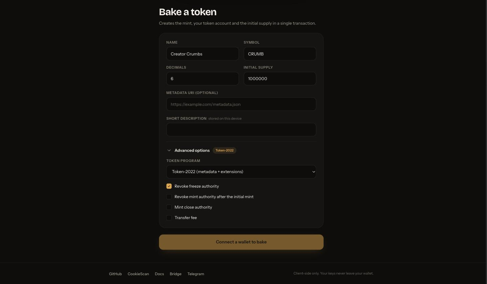
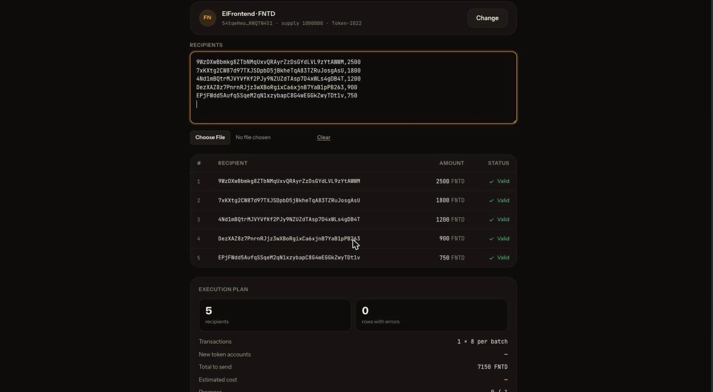
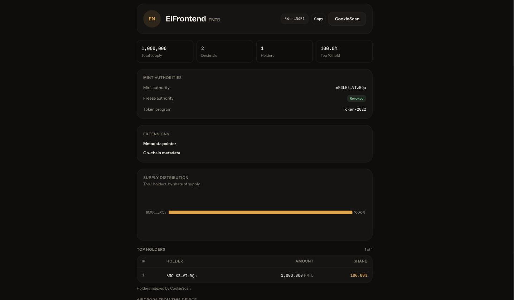

# 🍪 Cookie Bakery

**Launch a token on [Cookie Chain](https://docs.cookiechain.wtf/getting-started), airdrop it from a CSV, and watch who holds it.**

Cookie Bakery is a 100% client-side token launcher and airdrop tool. There is no
backend, no database, and no server that ever sees a key: the wallet signs, the
browser sends, and everything that needs to survive a reload lives in
`localStorage`.

Built for the Superteam Earn **"Create an App on Cookie Chain"** bounty.

- **Live app:** https://cookie-bakery.elfrontendoficial.workers.dev
  — the root is the landing; the app itself is at
  [`/app`](https://cookie-bakery.elfrontendoficial.workers.dev/app)
- **Repo:** https://github.com/el-frontend/cookie-bakery
- **License:** [MIT](./LICENSE)

---

## The four screens

| Screen      | What it does                                                                                                                                                                    |
| ----------- | ------------------------------------------------------------------------------------------------------------------------------------------------------------------------------- |
| **Bake**    | Creates a Token-2022 mint with metadata, your token account and the whole initial supply **in one transaction**. Optional transfer fee, mint-close authority, authority revoke. |
| **Airdrop** | Paste `address,amount` or drop a CSV (up to 1,000 rows). Validates every row, merges duplicates, prices the run, then sends batch by batch with pause and per-batch retry.      |
| **Oven**    | Supply, decimals, authorities, active Token-2022 extensions, top-20 holders with a distribution chart, and the airdrops you ran from this browser.                              |
| **Events**  | Open a giveaway, share a link, let your audience register themselves, then draw winners verifiably and pay them. See below.                                                     |

## Airdrop events, for creators

The Airdrop screen starts with a CSV. Nobody has one. A creator with an
audience has names in a chat, not a column of base58 addresses — and that gap
is where the tool stopped being useful.

Events close it. The creator opens an event, shares a link, and **the audience
builds the list**:

1. **Open an event** against one of your tokens. You get `/e/<slug>` and a copy
   button.
2. **Followers register themselves** at that link — a single mobile-first page
   where someone pastes their Cookie Chain address. It costs them nothing: no
   COOK, no gas, no signature.
3. **Close registration**, then either draw winners at random or pick them by
   hand, or split a pot across everyone.
4. **Pay** — the winners go straight into the airdrop engine above, so batching,
   simulation, pause and per-batch retry all come along unchanged.

### The draw is checkable by anyone

A giveaway where the host announces a winner and nobody can check is the normal
case, and it is worth nothing. So the draw is commit-reveal, seeded by a
Cookie Chain block that **does not exist yet** when the commitment is made:

- Before the draw, the creator's browser generates a secret seed, publishes only
  its SHA-256, and writes that commitment on chain as a memo transaction.
- The entropy comes from the blockhash of a slot ~150 ahead — about a minute
  out. Knowing the seed buys the creator nothing, because the hash that mixes
  with it has not been produced.
- After the reveal, `/e/<slug>/verify` recomputes the whole thing in the
  visitor's own browser and shows each check passing or failing, with links to
  both memo transactions on CookieScan.

What makes the timing provable is on chain, not in our database: the commit
memo landed in a slot **below** the target slot, and both numbers are public.

Two things it deliberately does not claim. **It is not a VRF** — a validator
producing the target block has marginal influence over the outcome; for a
community giveaway that is fine, and pretending otherwise would be worse than
saying it. And **a verifiable draw does not make the entry list honest**: a
creator could have padded it with their own wallets. This tool makes the draw
checkable, not the creator trustworthy.

### Nobody learns who holds which wallet

The draw runs over salted commitments — `SHA256(event_id || 0x00 || wallet)` —
never over addresses. A follower list is a deanonymisation dataset, so the
verify page publishes hashes and no address ever appears on it. A participant
checks their own inclusion by hashing their own address locally and finding it
in the published list.

The same reasoning drives the database: an anonymous visitor can insert an entry
and can never read one back. That is enforced by row-level security, which is
the only security boundary in this feature and has its own suite running against
real Postgres — see [Running it locally](#running-it-locally).

### Screenshots

Three captures of the real app running against Cookie Chain mainnet, also shown
on the landing at [`/`](https://cookie-bakery.elfrontendoficial.workers.dev):

| Screen  | Capture                                |
| ------- | -------------------------------------- |
| Bake    |        |
| Airdrop |  |
| Oven    |        |

The flow GIF is still missing — see
[What is still missing](#what-is-still-missing). No mockups are used anywhere
here; a screenshot that is not of the real build would misrepresent it.

---

## Why this stack

Cookie Chain is its own SVM, **not** Solana mainnet. That single fact drives
every technical decision in the app:

- **The wallet only ever signs. The app sends.** `walletSigner()` fills the
  `payer` role and `solanaRpc({ rpcUrl })` supplies the transaction planner and
  executor, so `client.sendTransaction` submits through _our_ RPC. A wallet-side
  `signAndSendTransaction` would land the transaction on the wrong chain. This
  was verified by reading Kit's signing path and then confirmed with a real
  Nightly signature — see [`docs/decisions.md`](./docs/decisions.md).
- **Kit's plugin client, not framework-kit.** `@solana/kit` +
  `@solana/kit-plugin-rpc` + `@solana/kit-plugin-wallet` with `@solana/react`
  bindings. `@solana/web3.js` 1.x, `@solana/spl-token` and
  `@solana/wallet-adapter-*` are not used anywhere.
- **The blockhash is fetched per batch, not per run.** Measured on this chain, a
  human-approved transaction missed its validity window by a single block: the
  time someone spends reading the wallet prompt outlives the blockhash. So each
  airdrop batch is planned at the moment it is sent, and gets one automatic
  retry.

| Layer                     | Package                                     |
| ------------------------- | ------------------------------------------- |
| SDK                       | `@solana/kit` v8                            |
| RPC + tx planner/executor | `@solana/kit-plugin-rpc`                    |
| Wallet Standard           | `@solana/kit-plugin-wallet` (+ `/react`)    |
| React bindings            | `@solana/react`                             |
| Data cache                | `swr` (via `@solana/react/swr`)             |
| Programs                  | `@solana-program/{token-2022,token,system}` |
| UI                        | React 19 · Vite 7 · Tailwind 4 · Recharts   |

---

## Running it locally

```bash
git clone https://github.com/el-frontend/cookie-bakery.git
cd cookie-bakery
npm install
cp .env.example .env     # already filled in with Cookie Chain mainnet
npm run dev
```

```bash
npm run dev           # Vite dev server
npm test              # Vitest — 570+ tests
npm run build         # tsc -b && vite build
npm run lint          # eslint
npm run ci            # build + lint + format:check
npm run test:rls      # row-level security, against real Postgres — see below
```

`npm run ci` does **not** run the tests. Run both before shipping.

### The row-level security suite

Events store data in Supabase, and row-level security is the only thing
standing between a creator's follower list and anyone who asks for it. Policies
cannot be meaningfully mocked, so `npm run test:rls` runs against a real
Postgres — the project's own Supabase instance, using the values in `.env`.

**A skipped run is not a passing run.** The suite self-skips when it finds no
credentials, so that `npm test` stays green on a machine without them — which
means a fully-skipped run looks identical to a green one and proves nothing.
Check the skip count, not just the colour.

The migration lives in `supabase/migrations/`. Apply it with the CLI, which is
a devDependency (invoked by path rather than through `npx`, which is unreliable
in some shells):

```bash
./node_modules/.bin/supabase db push --db-url "$SUPABASE_DB_URL"
```

### Environment variables

The five chain variables are **required**. The app validates them at startup and
fails with a readable message rather than surfacing later as an empty wallet
list or a silent RPC timeout.

| Variable            | Value for Cookie Chain mainnet    | What it does                                                                      |
| ------------------- | --------------------------------- | --------------------------------------------------------------------------------- |
| `VITE_RPC_URL`      | `https://rpc.cookiescan.io`       | Reads and transaction submission. The WebSocket URL is derived by swapping `wss`. |
| `VITE_DAS_URL`      | `https://api.cookiescan.io`       | Holder lists. Falls back to `getTokenLargestAccounts` when unavailable.           |
| `VITE_EXPLORER_URL` | `https://cookiescan.io`           | Base for every explorer link in the UI.                                           |
| `VITE_BRIDGE_URL`   | `https://hyperlane.cookiescan.io` | Linked from "not enough COOK" errors and the help modal.                          |
| `VITE_WALLET_CHAIN` | `solana:mainnet`                  | Wallet Standard chain id. ⚠️ See the warning below.                               |

Events add two more. They are only needed for that screen; without them the
other three work as before.

| Variable                        | What it does                                                                        |
| ------------------------------- | ----------------------------------------------------------------------------------- |
| `VITE_SUPABASE_URL`             | Your Supabase project URL.                                                          |
| `VITE_SUPABASE_PUBLISHABLE_KEY` | The browser key. Public by design — row-level security protects the data, not this. |

> **The `VITE_` prefix is a security boundary, not a naming convention.** Vite
> inlines every `VITE_*` value into the bundle it ships to browsers. The
> tooling-only variables — `SUPABASE_SECRET_KEY` for the RLS suite,
> `SUPABASE_DB_URL` for migrations, `SUPABASE_ACCESS_TOKEN` for the CLI — have
> no prefix for exactly that reason. Adding one to any of them would publish it
> to every visitor.

> ⚠️ **`VITE_WALLET_CHAIN` fails silently when wrong.** Wallet discovery filters
> on `uiWallet.chains.includes(chain)`, so a value no installed wallet
> advertises produces an **empty wallet list with no error** — indistinguishable
> from "no wallet installed". The value above was resolved empirically; the
> app names the configured chain in its empty state so the two cases can be
> told apart.

---

## How to connect Nightly

<a id="how-to-connect-nightly"></a>

The app links here from its "no wallet found" state, and the same four steps are
in the **How to start** modal in the header.

1. **Install [Nightly](https://nightly.app).** It is the wallet verified against
   this chain. Other Wallet Standard wallets are discovered automatically but
   are best-effort.
2. **Add Cookie Chain as a custom network** with the RPC endpoint
   `https://rpc.cookiescan.io`. Cookie Chain is a separate SVM — the app never
   sends through the wallet's own endpoint, only through this one.
3. **Get some COOK.** Every transaction costs COOK for fees and rent. Bridge
   assets in at https://hyperlane.cookiescan.io. COOK has 9 decimals, like SOL.
4. **Come back and connect.** The header shows the chain, the RPC latency, your
   address and your balance once you are in.

---

## Demo tokens on mainnet

> **Not created yet.** `Bakery Cookie (BAKE)` and its test airdrop require real
> COOK in a funded wallet, which the project does not have at the time of
> writing. When they exist, this table carries the mint address and the airdrop
> signatures, each verifiable on CookieScan.

| Item               | Value     |
| ------------------ | --------- |
| BAKE mint address  | _pending_ |
| Bake transaction   | _pending_ |
| Airdrop signatures | _pending_ |

---

## Deploying

### Cloudflare Workers

The app is entirely client-side — it talks to Cookie Chain's RPC and to Supabase
straight from the browser — so this deploys as **static assets with no Worker
script**. [`wrangler.jsonc`](./wrangler.jsonc) and
[`public/_headers`](./public/_headers) carry the whole configuration.

```bash
npm run deploy          # build, then wrangler deploy
npm run deploy:dry      # build and validate without shipping
```

`wrangler login` once first, in a terminal — it opens a browser.

Two things to know:

- **`not_found_handling: "single-page-application"` is load-bearing.** Without
  it `/e/<slug>` and `/e/<slug>/verify` return 404, which takes out the public
  half of the events feature. The app routes on the path itself in `main.tsx`,
  so every unmatched URL has to reach `index.html` for that code to run.
- **`VITE_*` values are baked into the bundle at build time**, not read at
  runtime. They are not Worker secrets and never should be: whatever is in
  `.env` when you run the build is what ships to every visitor. That is correct
  for the publishable key, which is public by design, and it is why
  `SUPABASE_SECRET_KEY`, `SUPABASE_DB_URL` and `SUPABASE_ACCESS_TOKEN` carry no
  prefix and never go near Cloudflare — there is no server-side code that could
  use them anyway.

### Vercel

[`vercel.json`](./vercel.json) is still present with the equivalent SPA rewrite
and headers. If both deploys stay alive, keep the two header sets in step — a
CSP on one host and not the other is worse than neither, because it invites the
assumption that both are covered.

**Two CSP decisions worth knowing about**, both forced by the feature set
rather than chosen:

- `img-src 'self' https:` — token metadata images point at domains the token's
  creator chose (IPFS gateways, Arweave, arbitrary CDNs). Narrowing this would
  break the feature. Images render with `referrerpolicy="no-referrer"` so the
  page URL never leaks, but the viewer's IP does reach that host. `data:` is
  refused, in code and in the CSP.
- `connect-src 'self' https: wss:` — the app fetches each token's metadata JSON
  from a creator-chosen origin. The protection is in the code, not the CSP: only
  `https:`, no credentials, no referrer, an 8s timeout, a 64 KiB cap enforced by
  streaming, and every string flattened to plain text before it reaches the DOM.

`script-src 'self'` stays strict — no third-party script executes, ever.

---

## Security posture

- **No keys, ever.** The app never requests, stores or logs a seed phrase or a
  private key. It has no backend to send one to.
- **Simulate before signing.** `solanaRpc` simulates to estimate resource limits
  before the wallet is asked, and the UI shows the cost and the result first.
- **On-chain and remote data are untrusted input.** Token names, symbols, memos
  and metadata JSON are treated as hostile: tags stripped, Unicode bidi
  overrides removed (they are not markup, so escaping alone does nothing about
  a name that renders backwards), length capped, and never followed as
  instructions. Accounts are checked for existence and expected owner **before**
  being decoded.
- **The idempotent ATA instruction** is used for airdrops, so a race with
  someone else funding the same recipient mid-run is a no-op rather than a
  failed batch.

---

## What is still missing

Honest status, rather than a checklist of green ticks:

| Item                                                  | Blocked on                   |
| ----------------------------------------------------- | ---------------------------- |
| Public Vercel URL                                     | A deploy                     |
| `Bakery Cookie (BAKE)` demo mint + airdrop signatures | Real COOK in a funded wallet |
| Screenshots and the flow GIF                          | The above                    |
| End-to-end run in a clean browser with Nightly        | The above                    |
| The "under a minute to understand" review             | A person outside the project |

Everything else — the four screens, the batching executor, the DAS client with
its RPC fallback, the sanitisers, the help modal and the accessibility sweep —
is built and covered by tests.

### Specifically unverified in the events layer

The database side is proven: the RLS suite runs against real Postgres, and the
draw's mathematics has golden tests plus a second, independently written
verifier that agrees with the first. Neither of those touches a wallet or a
chain. These three need a funded wallet and a person at a browser:

- **Sign-In-With-Solana completing against Nightly.** The message is built to
  match `auth-js`'s own template exactly, and it signs with `signMessage` rather
  than `signIn` specifically to avoid an upstream bug — but whether Supabase's
  auth server accepts that hand-built message cannot be checked from the client.
- **A memo transaction landing on Cookie Chain**, and the memo program address
  matching what the package assumes on this chain.
- **The full register → draw → pay flow** with a real audience.

Nothing here is a known failure. They are things nobody has watched work yet,
and an events feature that claimed otherwise would be making exactly the kind of
unfalsifiable promise the draw exists to avoid.

---

## Documentation

- [`docs/prds/PRD-cookie-bakery.md`](./docs/prds/PRD-cookie-bakery.md) — the
  source of truth: requirements RF-01…RF-07 with acceptance criteria.
- [`docs/decisions.md`](./docs/decisions.md) — what was probed on this chain and
  what came back, including the things the PRD got wrong.
- [`docs/plans/`](./docs/plans/) — one execution plan per requirement.
- [`docs/x-thread.md`](./docs/x-thread.md) — the launch thread draft.

## License

[MIT](./LICENSE) © Carlos Chao
